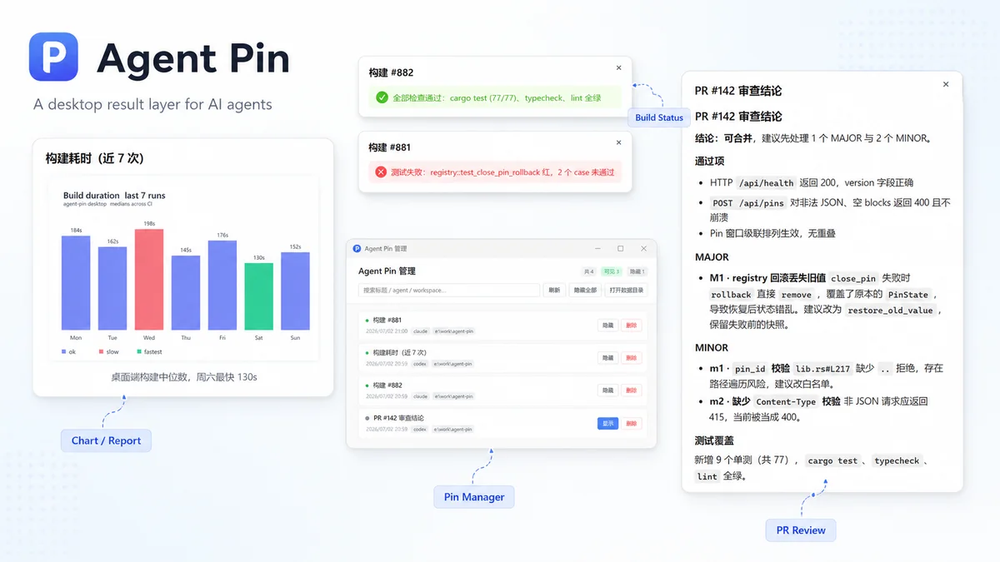

# Agent Pin

**AI 干完活，别让结果掉进聊天记录里。把它钉到桌面上。**

Agent Pin 是一个给 AI Agent 用的本地桌面 Pin 工具。  
Codex、Claude Code、Trae、Cursor 或其他 Agent 可以把重要结果推送成轻量桌面窗口：PR 审查结论、构建状态、截图、待办、风险提醒、方案摘要，都可以直接浮在桌面上。

> 多个 Agent 一起工作时，Agent Pin 就是你的桌面结果层。

<p align="center">
  <a href="https://github.com/donghao95/agent-pin/actions/workflows/ci.yml">
    
  </a>
  <a href="https://github.com/donghao95/agent-pin/releases">
    
  </a>
  <a href="LICENSE">
    
  </a>
</p>

<p align="center">
  <a href="#preview">Preview</a> ·
  <a href="#why">Why</a> ·
  <a href="#install">Install</a> ·
  <a href="#quick-start">Quick Start</a> ·
  <a href="#for-agents">For Agents</a> ·
  <a href="#development">Development</a>
</p>

---

## Preview

<p align="center">
  
</p>

<p align="center">
  <sub>A desktop result layer for AI agents.</sub>
</p>

---

## Why

AI Agent 越来越会干活，但结果经常散落在各种地方：

- 聊天窗口里
- 终端输出里
- IDE 侧边栏里
- PR 评论里
- 一长串上下文里
- 多个 Agent 的不同窗口里

有些结果不该被淹没。

比如：

- “这个 PR 不能合并，原因是……”
- “构建失败，失败点在……”
- “这张图是最终效果图”
- “这几个事项明天继续处理”
- “这个方案有一个明显风险”

Agent Pin 做的事很简单：

```text
Agent 产出重要结果
  -> 调用 agent-pin
  -> 桌面出现一个 Pin
```

---

## Install

### 推荐方式：让你的 Agent 帮你安装

把下面这段话发给你的 AI Coding Agent：

```text
帮我安装并配置 Agent Pin：https://github.com/donghao95/agent-pin

请从 Releases 安装桌面应用和 agent-pin CLI，把 CLI 加到 PATH，并把仓库里的 skills/agent-pin/SKILL.md 导入为你可使用的 Skill / 规则。完成后运行 agent-pin --json health，并创建一个测试 Pin。
```

### 手动安装

从 Releases 下载：

```text
https://github.com/donghao95/agent-pin/releases
```

当前主要面向 Windows：

```text
Agent-Pin_x.x.x_x64-setup.exe        桌面应用安装包
agent-pin-vx.x.x-windows-x64.zip     CLI 二进制
```

安装步骤：

1. 安装 `Agent-Pin_x.x.x_x64-setup.exe`
2. 启动 Agent Pin
3. 解压 CLI zip
4. 将 `agent-pin.exe` 放到 PATH
5. 在终端运行：

```bash
agent-pin --json health
```

看到成功返回后，即可使用。

---

## Quick Start

创建一个 `pin.json`：

```json
{
  "version": 1,
  "title": "PR 审查结果",
  "blocks": [
    {
      "type": "markdown",
      "content": "## 结论\n发现 2 个问题，建议先修复鉴权逻辑再合并。"
    }
  ]
}
```

推送到桌面：

```bash
agent-pin --json push --file ./pin.json
```

桌面会出现一个新的 Pin 窗口。

常用命令：

```bash
agent-pin --json health
agent-pin --json push --file ./pin.json
agent-pin --json list
agent-pin --json show <pinId>
agent-pin --json hide <pinId>
agent-pin --json hide-all
```

完整 CLI 说明见：

```text
docs/04_cli.md
```

---

## What can be pinned

Agent Pin 当前支持三类内容：

| Block | 用途 |
|---|---|
| `markdown` | 结论、摘要、待办、审查结果、短报告 |
| `image` | 截图、生成图片、设计稿、效果图 |
| `status` | 成功、失败、警告、任务状态 |

一个 Pin 可以包含多个 block。

例如，Markdown + 图片：

```json
{
  "version": 1,
  "title": "效果图参考",
  "blocks": [
    {
      "type": "markdown",
      "content": "## 说明\n这张图适合作为方案参考。"
    },
    {
      "type": "image",
      "path": "./mockup.png",
      "caption": "Agent 生成的效果图"
    }
  ]
}
```

状态 Pin：

```json
{
  "version": 1,
  "title": "构建状态",
  "blocks": [
    {
      "type": "status",
      "level": "success",
      "text": "构建通过。"
    }
  ]
}
```

---

## For Agents

Agent 自动创建 Pin 时，推荐统一使用：

```bash
agent-pin --json push --file ./pin.json
```

不要直接调用底层本地服务。

Agent Pin 更适合展示短而重要的结果：

- 最终结论
- 风险提醒
- 关键截图
- 下一步待办
- 任务状态
- 需要用户稍后查看的内容

不适合 pin：

- 完整聊天记录
- 大段过程日志
- 无筛选的终端输出
- 纯装饰性内容
- 隐私信息或密钥

给 Agent 使用的规则和示例见：

```text
skills/agent-pin/SKILL.md
```

---

## Features

- 一个 Pin 一个独立桌面窗口
- 支持 Markdown / Image / Status
- 支持多 block 混排
- 支持窗口拖动、缩放、置顶、关闭
- 支持最近 Pin 历史
- 关闭后可恢复
- 系统托盘常驻
- 独立管理界面
- 应用重启后历史保留
- CLI-first，适合 Agent 调用
- 本地优先，无账号、无云同步、无远程访问

---

## Current Status

Agent Pin 当前处于 MVP 阶段。

已实现：

- Tauri 桌面应用
- Rust CLI
- 系统托盘
- Markdown / Image / Status Pin
- Pin 历史与恢复
- 管理界面
- Agent Skill
- 更新检查

当前不做：

- choice / 选择题交互
- 用户点击事件回流
- Agent 自动继续执行
- 完整 Artifact 系统
- 云同步
- 账号系统
- 远程访问
- MCP Server
- 截图 / OCR / 录屏
- 图片编辑

---

## Project Structure

```text
agent-pin/
  apps/desktop/         Tauri 桌面应用
  packages/cli/         agent-pin CLI
  packages/shared/      Pin JSON 类型与校验逻辑
  docs/                 产品与工程文档
  skills/agent-pin/     给外部 Agent 使用的 skill
  examples/pins/        Pin JSON 示例
```

---

## Docs

```text
docs/00_README.md
```

常用文档：

```text
docs/01_product_spec.md       产品规格
docs/04_cli.md                CLI 使用说明
docs/05_ui_style.md           UI 风格
docs/06_phase_plan.md         分期与验收
skills/agent-pin/SKILL.md     Agent 使用规则
```

---

## Development

前置要求：

```text
Windows 11
Node.js >= 20
pnpm 10.x
Rust stable
```

本地开发：

```bash
pnpm install
pnpm dev
```

生产构建：

```bash
pnpm build
```

提交前检查：

```bash
pnpm sync-version:check
pnpm lint
pnpm typecheck
cargo check --manifest-path packages/shared/Cargo.toml --locked
cargo check --manifest-path packages/cli/Cargo.toml --locked
cargo check --manifest-path apps/desktop/src-tauri/Cargo.toml --locked
```

---

## Security

Agent Pin 是本地优先工具。

不要通过代理、端口转发或网络映射把本地服务暴露到外部网络。

漏洞报告见：

```text
SECURITY.md
```

---

## License

[Apache License 2.0](LICENSE)
